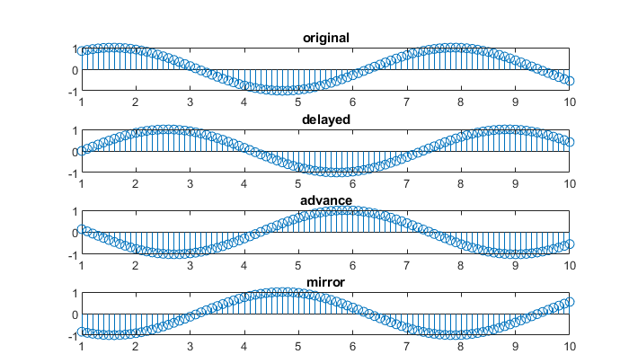
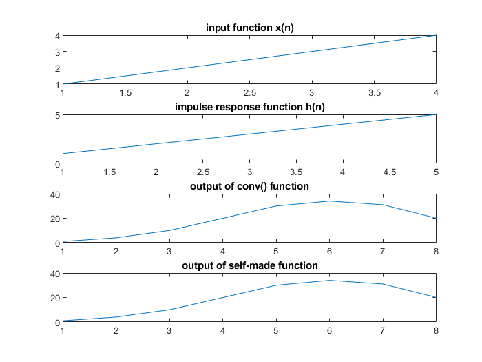
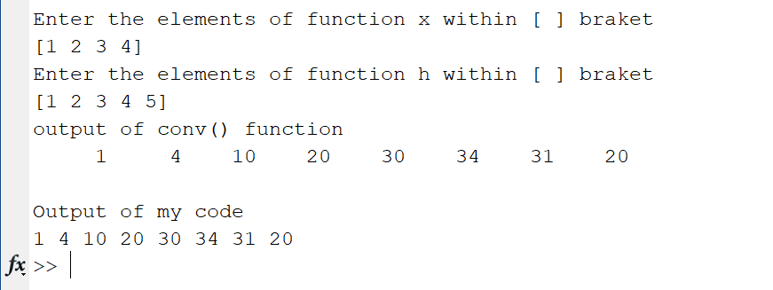

### Experiment No. 1
### Experiment Name 
Basic Operations on Discrete Signal and Comparison between Conv() Function and Self-Made Convolution Function
### Theory
<div style='text-align: justify;'>
  Convolution is a tool that helps to determine the output of a Linear Time Invariant(LTI) system with the
help of any input signal x(n) and impulse response h(n) of that specific system.
Due to convolutions commutative law, both expression of convolution is right.


</div>
 
### Code
**Basic operation on discrete signal**
```Matlab
t = 1:0.1:10;

y =@(t)sin(t);

subplot(5,1,1);
stem(t, y(t));
title('original');

subplot(5,1,2);
stem(t, y(t-1));
title('delayed');

subplot(5,1,3);
stem(t,y(t+2));
title('advance');

subplot(5,1,4);
stem(t, y(-t));
title('mirror');

```

**Comparison of Conv() function and self-made function**
```Matlab
clc
x = input('Enter the elements of function x within [ ] braket\n');
l = length(x);
h = input('Enter the elements of function h within [ ] braket\n');
m = length(h);

N = l + m -1;

subplot(4,1,1);
plot(x);
title('input function x(n)');

subplot(4,1,2);
plot(h);
title('impulse response function h(n)');
 
subplot(4,1,3);
y = conv(x, h);
plot(y);
title('output of conv() function');

h = flip(h,2);

res=zeros(1,N);

itr=1;
fprintf('Output of my code\n');
for i = (m-1): -1 : 0
    y=0;
    for k = 1:l
        if (k+i) > m
            break;
        end    
        y = y +  x(k) * h(k+i);
                
    end
    fprintf('%d ',y);
    res(itr) = y;
    itr=itr+1;
    
end

lim = N - m ;

for i = 1:lim
    y=0;
    for k = 1:m
        if (k+i) > l
            break;
        end    
        y = y +  h(k) * x(k+i);
        
    end
    fprintf('%d ',y);
    res(itr) = y;
    itr=itr+1;
    
end
fprintf('\n');

subplot(4,1,4);
plot(res);
title('output of self-made function');

```
### Output

*Fig. 1 Output of basic operation on discrete signal*

 
*Fig. 2 Plot of all input and output function*

 
*Fig. 3 Console output*

### Discussion
Operations on discrete signal gave proper output and self-made convolution function’s output matched exactly with the built-in conv function.

### Conclusion
In this experiment, I have learned about some basic operation on digital signal and also implemented Convolution function. 


