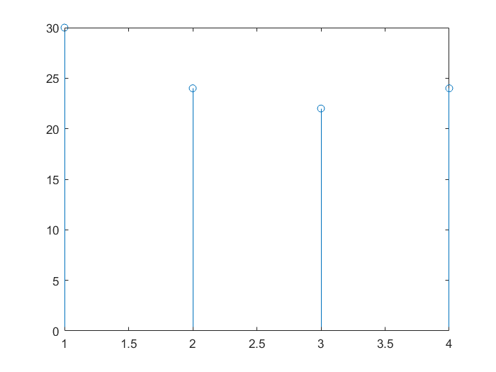
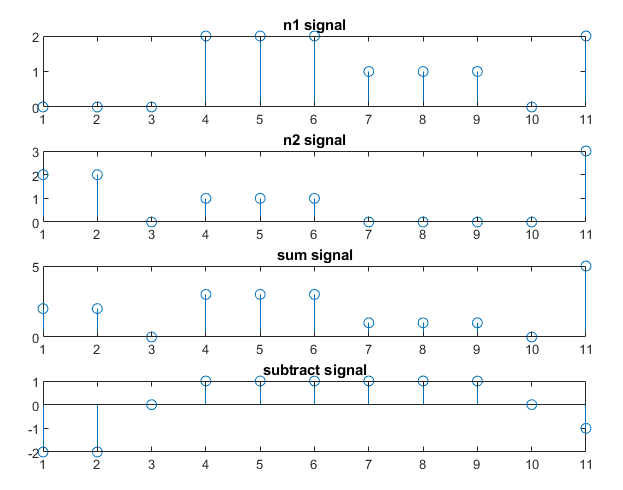
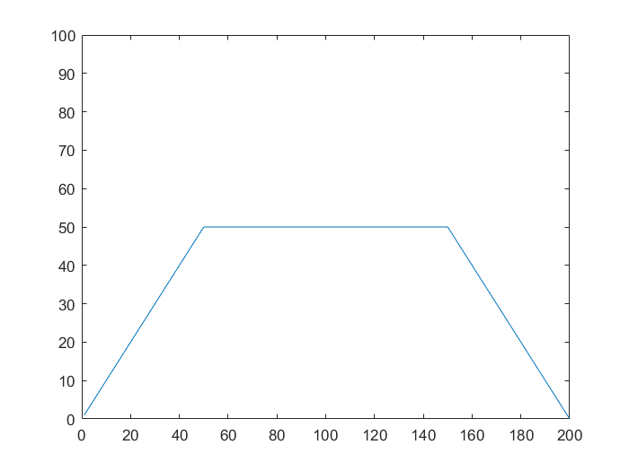

### Experiment No. 2
### Experiment Name 
Study of Circular Convolution, Basic Discrete Signal Operation & Trapezoidal Signal Generation
### Theory
<div style='text-align: justify;'>
  Convolution is a tool that helps to determine the output of a Linear Time Invariant(LTI) system with the help of any input signal x(n) and impulse response h(n) of that specific system. 

</div>
 
### Code
**Circular Convolution**
```Matlab
clc
x = [ 1 2 3 4]
h = [ 1 2 3 4]

n = length(x);
anss = zeros(1,n);

k=1;
for l=1:n
   
    res = x * h.';
    anss(k) = res;
    k=k+1;
    
    first = x(1);
    for j=1:(n-1)
        x(j) = x(j+1);
    end
    x(n) = first;

end

disp(anss);
figure(1)
stem(anss);

```

**Addition & subtraction of two discrete signal**
```Matlab
clc

n1 = [0,0,0,2,2,2,1,1,1,0,2]
n2 = [2 2 0 1 1 1 0 0 0 0 3]

summ = n1 + n2;

subplot(4,1,1);
stem(summ);
title('n1 signal');

subplot(4,1,2);
stem(summ);
title('n2 signal');

subplot(4,1,3);
stem(summ);
title('sum signal');

subb = n1-n2;
subplot(4,1,4);
stem(subb);
title('subtract signal');

```

**Code to draw trapezoidal signal**
```Matlab

clc

t = (1:200)';

unitstep = (t>=1 & t<=50);% to generate ramp signal
ramp = t.*unitstep;


unitstep_for_step_signal = (t> 50 & t<=150);
step_signal = 50* unitstep_for_step_signal;


unitstep_for_negative_ramp = (t>150 & t<=200);
negative_ramp = 200 - t.* unitstep_for_negative_ramp;
negative_ramp = negative_ramp .* unitstep_for_negative_ramp;

final_signal = ramp + step_signal + negative_ramp;

plot(t, final_signal);
ylim([0 100]);

```

### Output

*Fig. 1 Plot of circular convolution*

 
*Fig. 2 Plot of summation and subtraction of two signals*

 
*Fig. 3 Trapezoidal Signal*

### Discussion
All program shows expected output and all the plots are accurate. 

### Conclusion
In this experiment, I have learned about circular convolution, basic discrete signal operation & trapezoidal signal generation.


