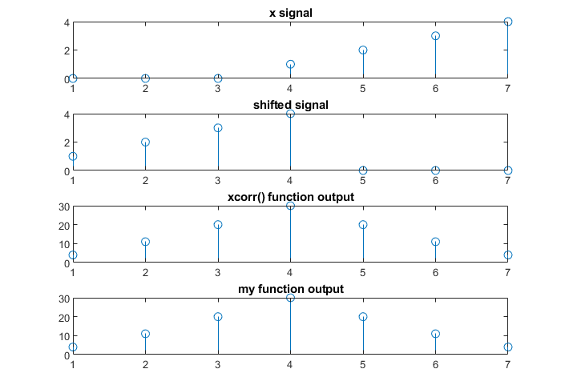
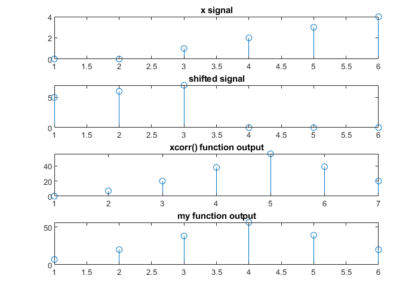

### Experiment No. 3
### Experiment Name 
Study of Auto-Correlation & Cross-Correlation in Matlab
### Theory
<div style='text-align: justify;'>
Autocorrelation, sometimes known as serial correlation in the discrete time case, is the correlation of a signal with a delayed copy of itself as a function of delay. The analysis of auto-correlation is a mathematical tool for finding repeating patterns, such as the presence of a periodic signal obscured by noise, or identifying the missing fundamental frequency in a signal implied by its harmonic frequencies.

</div>
 
### Code
**Auto-Correlation**
```Matlab
clc
x = input('Enter the matrix element within [ ] bracket\n');
size_x = length(x);
disp(size_x);

x_c = zeros(1,(size_x+ (size_x-1)));
for i=1:size_x
   x_c(i+size_x-1) = x(i); 
end

subplot(4,1,1);
stem(x_c);
title('x signal');

shift_x = circshift(x_c,size_x);

subplot(4,1,2);
stem(shift_x);
title('shifted signal');

res = zeros(1,2*size_x-1);
j=1;
for k=(size_x-1):-1:0
    
    for i=1:size_x
        if i+k > size_x 
            break
        end
       res(j)= res(j)+ x(i)*x(i+k);
    end
    j = j+1;
end

for k=1:(size_x-1) 
    
    for i=1:size_x
        if i+k> size_x
            break
        end
        res(j) =  res(j)+ x(i)*x(i+k);
    end
     j=j+1;
end

disp(res);

ress = xcorr(x);
disp(res);

subplot(4,1,3);
stem(ress);
title('xcorr() function output');


subplot(4,1,4);
stem(res);
title('my function output');

    

```

**Cross-Correlation:**
```Matlab
clc
x = input('Enter the elements of x within [ ] bracket\n');
y = input('Enter the elements of y within [ ] bracket\n');
l = length(x);
m = length(y);
disp(l);

s = xcorr(x,y);
disp(s);

x_c = zeros(1,(l+m-1));
y_c = zeros(1,(l+m-1));
for i=1:l
   x_c(i+m-1) = x(i); 
end

for i=1:m
   y_c(i) = y(i); 
end

subplot(4,1,1);
stem(x_c);
title('x signal');


subplot(4,1,2);
stem(y_c);
title('shifted signal');

res = zeros(1,(l+m-1));
j=1;
for k=(m-1):-1:0
    
    for i=1:l
        if i+k > m
            break
        end
       res(j)= res(j)+ x(i)*y(i+k);
    end
    j = j+1;
end

for k=1:(l-1) 
    
    for i=1:m
        if i+k> l
            break
        end
        res(j) =  res(j)+ y(i)*x(i+k);
    end
     j=j+1;
end

disp(res);

ress = xcorr(x,y);
disp(ress);

subplot(4,1,3);
stem(ress);
title('xcorr() function output');


subplot(4,1,4);
stem(res);
title('my function output');   

```


### Output

*Fig. 1 Plot of auto-correlation*

 
*Fig. 2 Plot of cross-correlation*


### Discussion
All program showed expected output and all the plots were accurate.  

### Conclusion
I have learned about auto-correlation and cross-correlation in this experiment. 


