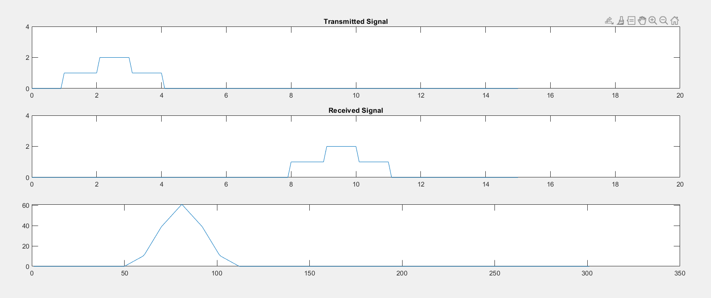
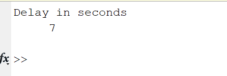

### Experiment No: 04
### Experiment Name: 
Study of the Calculation of Signal  Delay
### Theory:
<div style='text-align: justify;'>
  Delay of signal can be calculated with the help of cross-correlation. Signals from the sender end and receiver end can be passed in the built-in Matlab function xcorr() and it will return a range of values of correlation. The time at which correlation value is maximum indicates delay.
</div>
 
### Code:
```Matlab
clc
t=0:0.1:15;
length(t);

s1 = (t>=0 & t<=1);
y = s1*1;
length(s1);

s2 = (t>1 & t<=2);
y=y+s2*2;

s3 = (t>2 & t<=3);
y=y+s3*1;

subplot(4,1,1);
plot(t,y);
title('Transmitted Signal');

s1 = (t>=8 & t<=9);
yy = s1*1;

s2 = (t>9 & t<=10);
yy=yy+s2*2;

s3 = (t>10 & t<=11);
yy=yy+s3*1;

subplot(4,1,2);
plot(t,yy);
title('Received Signal');

subplot(4,1,3);
result = xcorr(y,yy);
plot(result); 

val = 1;
disp('printing values of length index');
for i=1:length(result)
   if result(i)>result(val)
       val= i;
   end
end

index = val/10-1.1;
disp(index);

```
### Output

*Fig. 1 Signal delay plot*

 
*Fig. 2 Console output*

### Discussion
From the figures it is clear that signal was 7 second delay and output of console also satisfied it.

### Conclusion
In this experiment, I have learned how to calculate delay between one signal and delayed version of it. 


