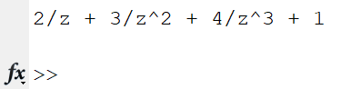
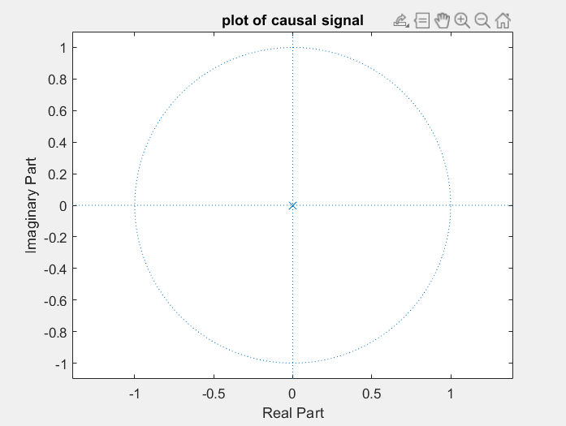

### Experiment No: 05
### Experiment Name: 
Study of Z-Transformation & Plotting of Zeros-Poles for a Given Causal Signal in Time Domain
### Theory:
<div style='text-align: justify;'>
 A continuous time signal 𝑥(𝑡) is called causal signal if the signal 𝑥(𝑡) = 0 for 𝑡 < 0. Therefore, a causal signal does not exist for negative time. The unit step signal u(t) is an example of causal signal.
<br><br>
Similarly, a discrete time sequence x(n) is called the causal sequence if the sequence x(n) = 0 for n < 0.
</div>

<br>

### Code:
```Matlab
clc

x= [1 2 3 4];

syms z
y=0;
for i=1:length(x)
   y = y + x(i)*z^-(i-1);
end

disp(y);

p = poles(y,z);

zplane([],p);
title('plot of causal signal');
```
<br>

### Output
\
*Fig. 1 Output of z-transform of signal*

\
*Fig. 2 Plot of zeros-poles for a causal signal*
<br>

### Discussion
<div style='text-align: justify;'>
From figure 1, a generalized form of causal signal could be realized. The only pole of this expression was plotted in figure 2. Also this expression has no zero value. It also reflected in the plot of figure 2. 
</div>
<br>

### Conclusion
<div style='text-align: justify;'>
In this experiment, I have learned about z-transform, zeros-poles determination and how to plot those zeros and poles of causal signal in matlab. 
</div>


