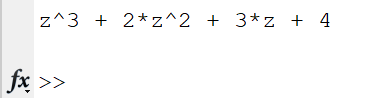
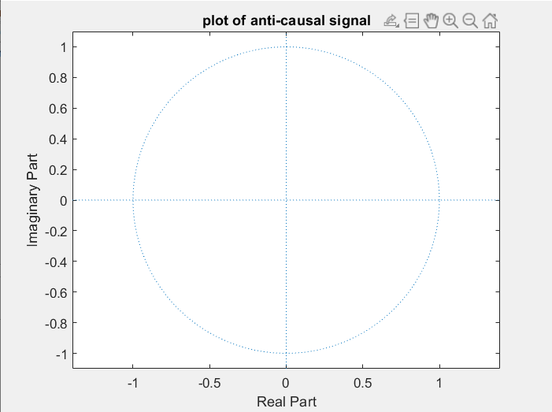

### Experiment No: 06
### Experiment Name: 
Study of Z-Transformation & Plotting of Zeros-Poles for Anti-Causal Signal
### Theory:
<div style='text-align: justify;'>
 A continuous-time signal x(t) is called the anti-causal signal if x(t) = 0 for t > 0. Hence, an anti-causal signal does not exist for positive time.
 <br><br>
 Similarly, a discrete time sequence x(n) is said to be anti-causal sequence if the sequence x(n) = 0 for 𝑡 > 0.
</div>

<br>

### Code:
```Matlab
clc

x= [1 2 3 4];

syms z
y=0;
sz =length(x); 
for i=1:sz
   y = y + x(i)*z^(sz-i);
end

disp(y);

zplane([],[]);
title('plot of anti-causal signal');
```
<br>

### Output
\
*Fig. 1 Output of z-transform of signal*

\
*Fig. 2 Plot of zeros-poles for a anti-causal signal*
<br>

### Discussion
<div style='text-align: justify;'>
 From figure 1, a generalized form of anti-causal signal could be realized. This expression has one pole which is infinity and no zero value. And an infinity pole couldn't be plotted on a figure. That's why figure 2 was blank and had no zeros or poles drew in it. 
</div>
<br>

### Conclusion
<div style='text-align: justify;'>
In this experiment, I have learned about z-transform, zeros-poles determination and how to plot those zeros and poles of anti-causal signal in matlab. 
</div>
