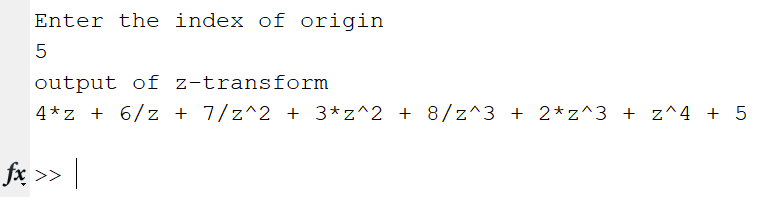
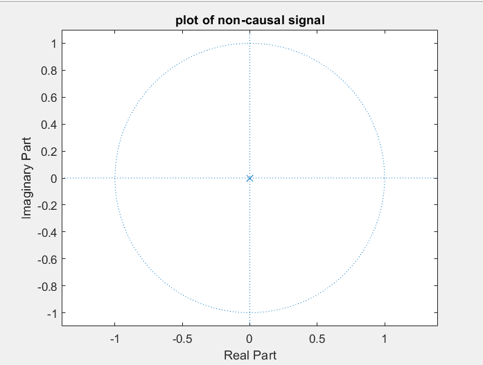

### Experiment No: 07
### Experiment Name: 
Study of Z-Transformation & Plotting of Zeros-Poles for Non-Causal Signal
### Theory:
<div style='text-align: justify;'>
  A signal which is neither causal nor anti-causal is called the non-causal signal. Hence, by the definition, a signal that exists for positive as well as negative time is neither causal nor anti-causal, it is non-causal signal. The sine and cosine signals are examples of non-causal signal
</div>
 
### Code:
```Matlab
clc

x= [1 2 3 4 5 6 7 8];

pos = input('Enter the index of origin\n');
pos=pos-1;

syms z
y=0;
for i=1:length(x)
   y = y + x(i)*z^(pos);
   pos=pos-1;
end

disp('output of z-transform');
disp(y);

p = poles(y,z);

zplane([],p);
title('plot of causal signal');
```
### Output
\
*Fig. 1 Output of z-transform of signal*

\
*Fig. 2 Plot of zeros-poles for a non-causal signal*

### Discussion
<div style='text-align: justify;'>
 From figure 1, a generalized form of non-causal signal could be realized. This expression has one pole which is zero and no zero value. And value of that pole had reflected in figure 2.  
</div>
<br>

### Conclusion
<div style='text-align: justify;'>
In this experiment, I have learned about z-transform, zeros-poles determination and how to plot those zeros and poles of non-causal signal in matlab. 
</div>
